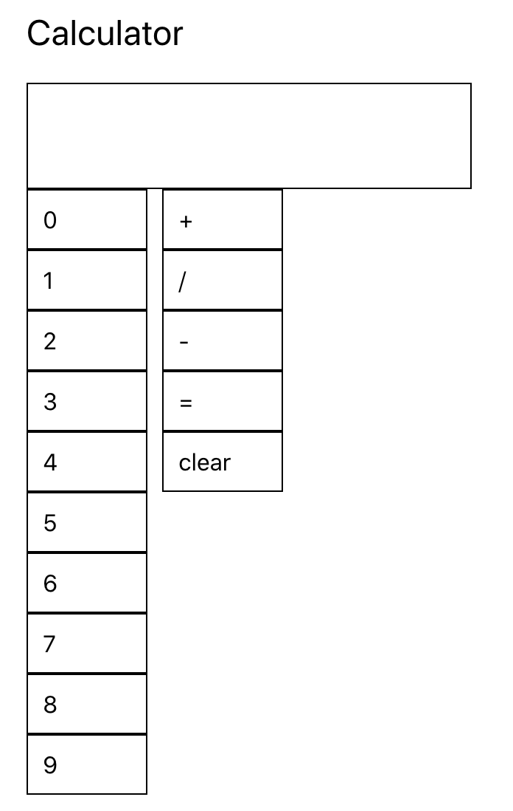

## Homework 4

In this assignment you will create a basic calculator and style it using `CSS`, `inline styles`, or `styled-components`.

As you can tell the current layout needs a lot of styling work. Modify the layout, components, and calculator logic however you want. Everything is free game!

## Deliverable

1. Get the calculator to work using `useState` (you do not need to use `useRef`). Your calculator should take two numbers and perform one of the following operations: addition, subtraction, multiplication, and division. Hitting = should output the correct result. Your calculator should also support clearing.
2. Style the calculator however you want. Feel free to use any colors, layout, and animations that you would like. Be creative!
3. Deploy your application using any method you want (repo is setup for Github actions). Add the url: URL_TO_PROJECT

### Deployment Instructions (Github actions)

[Deployment instructions](https://github.com/prof-tejera/react-deployment-code#github-actions)

## How to run the project

`npm i && npm start`

Open [http://localhost:3000](http://localhost:3000)
